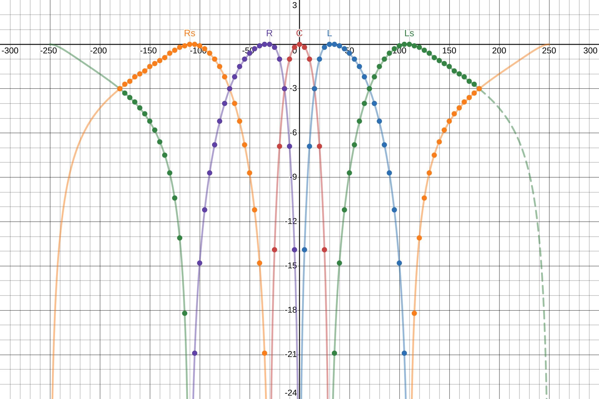

*Polar plot for the surround-5 layout showing per-speaker gain (linear) as a function of source azimuth (degrees)*.

# Dr. Bafflegab's Vector Base Amplitude Panner (VBAP)

[](https://github.com/drbafflegab/vbap/actions/workflows/ci.yml)

Dr. Bafflegab’s VBAP is a minimalistic, dependency‑free C17 implementation of 2D **Vector Base Amplitude Panning** (VBAP). It spatializes one or more audio sources across an arbitrary loudspeaker ring by computing per‑speaker gains, and is designed for real-time audio use, such as game engines, embedded DSP, and educational projects.

## Features

- **Minimal, portable C17:** One header + one source; cross-platform; no third-party dependencies; C++ compatible.
- **Real-time & embed-friendly:** Thread-safe opaque handle; no dynamic allocations; deterministic.
- **Equal-power panning:** Constant-loudness VBAP panning for arbitrary 2D loudspeaker layouts.
- **Fast, batched workflow:** One‑time construction; Processes many sources in one go with O(1) work per source.
- **SIMD-accelerated:** Vectorised path on x86/x86-64 (SSE2) and AArch32/AArch64 (NEON); compile-time selection with automatic scalar fallback; no run-time dispatch.
- **MIT Licence:** Free for commercial, open-source, and academic use.

## Theory

*Vector Base Amplitude Panning* (Pulkki, 1997) positions a virtual sound by driving the *nearest two* loudspeakers (in 2D) with gains chosen so the vector sum of the loudspeaker directions points toward the target. Compared to HRTF convolution, VBAP is lightweight and scales to many simultaneous sources while preserving directional cues on loudspeaker setups.

### References

- Pulkki, V. (1997). *Virtual Sound Source Positioning Using Vector Base Amplitude Panning*. **JAES**, 45(6), 456–466.
- Pulkki, V. (1998). *Creating Auditory Displays with Multiple Loudspeakers using VBAP*. **ICAD**.

## Installation & Integration

To integrate the library, copy [`drb-vbap.h`](drb-vbap.h) and [`drb-vbap.c`](drb-vbap.c) into your project and compile them with your C17 toolchain. The header file exposes a few functions:

- `drb_vbap_2d_size(…)`: Returns the number of bytes you must provide to construct a VBAP instance.
- `drb_vbap_2d_construct(…)`: Initializes a VBAP instance in user-provided memory. Returns `NULL` on error.
- `drb_vbap_2d_compute_gains(…)`: Computes per-speaker gains for one or more source angles.

See [`drb-vbap.h`](drb-vbap.h) for the full API documentation.

## Example

TODO: Write description of what we do in this example.

1. TODO

    ```c
    enum { source_count = 73, speaker_count = 5 };

    float source_positions [source_count * 2];
    float speaker_gains [source_count * speaker_count];
    ```

2. TODO

    ```c
    char const * const tag = DRB_VBAP_LAYOUT_TAG_SURROUND_5;

    DrB_VBAP_Layout const * const layout = drb_vbap_builtin_layout(tag);

    void * const memory = malloc(drb_vbap_size(layout));
    ```

3. TODO

    ```c
    DrB_VBAP_Error error;

    DrB_VBAP const * const vbap = drb_vbap_construct(memory, layout, &error);

    if (vbap == NULL)
    {
        fprintf(stderr, "Error: %s.\n", drb_vbap_error_string(error));

        return EXIT_FAILURE;
    }
    ```

4. TODO

    ```c
    static const float two_pi = 6.28318530717958647692f;

    for (int_fast32_t source = 0; source < source_count; source++)
    {
        float const theta = (float)source * two_pi / (float)(source_count - 1);

        source_positions[source * 2 + 0] = cosf(theta);
        source_positions[source * 2 + 1] = sinf(theta);
    }
    ```

5. TODO

    ```c
    drb_vbap_process(vbap, source_positions, speaker_gains, source_count);
    ```

6. TODO

    ```c
    for (int_fast32_t source = 0; source < source_count; source++)
    {
        float const theta = (float)source * 360.0f / (float)(source_count-1);

        printf("%+4.0f°:", theta - 180.0f);

        for (int_fast32_t speaker = 0; speaker < speaker_count; speaker++)
        {
            int_fast32_t const index = source * speaker_count + speaker;

            printf(" %7.5f", speaker_gains[index]);
        }

        printf("\n");
    }
    ```

7. TODO

    ```c
    free(memory);
    ```

Graph of the example results:



## Building the Tests

You need a [C17](https://en.wikipedia.org/wiki/C17_(C_standard_revision))-capable compiler (GCC/Clang/MSVC) and [CMake](https://cmake.org). From within your cloned repository follow these steps:

1. Configure the project and generate build files in the subdirectory `build`:

    ```bash
    cmake -B build
    ```

2. Build the project:

    ```bash
    cmake --build build
    ```

3. Run the [tests](tests):

    ```bash
    ctest --test-dir build
    ```

## SIMD Acceleration

The library includes vectorised implementations for **SSE2** and **NEON**. SIMD selection is done at compile time based on the target architecture. If the target lacks these instruction sets, the code automatically falls back to a scalar path. No runtime dispatch and no extra dependencies.

- **x86/x86-64:** On 32-bit x86, enable SSE2 in your compiler flags (e.g., GCC/Clang: `-msse2`; MSVC: `/arch:SSE2`) to use the vectorised path. On 64-bit x86, SSE2 is baseline and enabled by default.
- **AArch32/AArch64:** On 32-bit ARM, NEON is used when requested in the target flags (e.g., `-mfpu=neon`). On 64-bit ARM, NEON is baseline and enabled by default.

## Used by

- [MojoAL](https://github.com/icculus/MojoAL)
- [Simple DirectMedia Layer](https://www.libsdl.org)

Know another project? [Email me](mailto:drbafflegab@protonmail.com).

## Contributing

Contributions are welcome! Feel free to submit issues, feature requests, or pull requests.

## Licence

The project is released under the **[MIT](https://opensource.org/license/mit)** licence. You can use, modify, and distribute it freely for any purpose, subject to the terms in [LICENSE](LICENSE).
